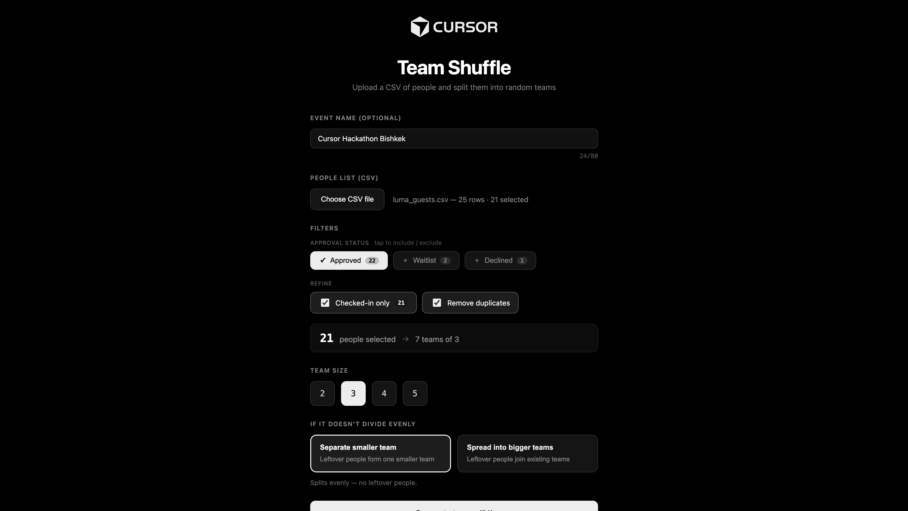

# Team Shuffle

Upload a CSV of people and split them into random teams — in seconds.
Built for hackathons and events where you need fair groups on the spot.

No sign-up, no server. Everything runs in your browser.

## Screenshots

**1. Set up** — upload your list, filter who's in, pick a team size.



**2. Get teams** — random, balanced teams you can shuffle, search, and export.


## Quick start

```bash
npm install
npm run dev
```

Then open the URL it prints (usually http://localhost:5173).

## How to use

1. **Upload a CSV.** Click **Choose CSV file** and pick your guest list.
   Works great with a [Luma](https://lu.ma) export (Event → Guests → Export),
   but any CSV with a name column works.
2. **Choose who's in.** Filter by approval status, keep only checked-in people,
   and remove duplicates. The summary shows how many teams you'll get.
3. **Pick a team size** (2–5) and what to do with leftovers:
   - **Separate smaller team** — leftovers form one smaller team.
   - **Spread into bigger teams** — leftovers join existing teams.
4. **Generate teams.** Then **Shuffle again**, **Find a name**, or **Export CSV**.

## Good to know

- **Auto-detects columns** — name, email, status, and check-in time are found
  automatically, so there's no manual mapping.
- **Random & fair** — teams are shuffled with Fisher–Yates. Re-shuffle anytime.
- **Private** — your list is read in the browser and never uploaded. `*.csv`
  files are git-ignored so they can't be committed by accident.

## Commands

```bash
npm run dev      # start the dev server
npm run build    # production build to dist/
npm run preview  # preview the production build
```

## Tech

Vite + React + TypeScript. It's a static app — deploy the `dist/` folder to any
static host (e.g. Vercel, Netlify, GitHub Pages).

```
src/
├─ TeamShuffle.tsx        # state + screen routing
├─ components/
│  ├─ LogoBar.tsx
│  ├─ SetupScreen.tsx     # upload + filters + options
│  └─ ResultsScreen.tsx   # teams + search + export
└─ lib/teams.ts           # core logic: parse, filter, shuffle
```
